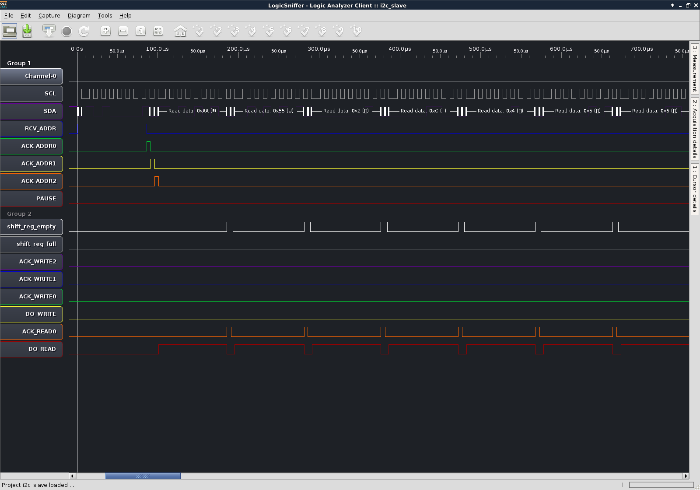
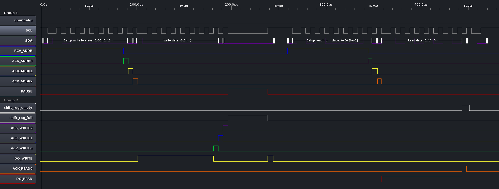

## Documentation ##

With this code you can emulate any I2C (slave side) protocol.

The code in [main.c](https://github.com/fallen/i2cslave/blob/shift_register_complex/i2cslave/software/main.c) is an example of EEPROM emulation.

Basically there are two ways of reading an EEPROM via I2C: 

### Doing only sequential reads ###

The master can chose to only issue I2C reads to the slave and the slave will autoincrement its internal address
(the address to select the data, not the slave address) and send out the data sequentially.

I tested my code with the following Arduino code:

```C
#include <Wire.h>

void setup() {
  Wire.begin();        // join i2c bus
  Serial.begin(9600);  // start serial for output
}

void loop() {
  Wire.requestFrom(0x50, 9);    // request 9 bytes from slave device #8

  while (Wire.available()) { // slave may send less than requested
    unsigned char c = Wire.read(); // receive a byte as character
    Serial.print(c, HEX);         // print the character
    Serial.print(", ");
  }
  Serial.println("");

  delay(10000);
}
```
Basically the Arduino sends 9 I2C reads to the slave at address 0x50 (our emulated EEPROM).
Then the Arduino prints what it receives (for debug) to its Serial console.

On the slave side, the code running is there: https://github.com/fallen/i2cslave/blob/shift_register_complex/i2cslave/software/main.c#L24

Here is a screenshot of what the logic analyser shows:


If you want to see the SDA line more clearly instead of seeing the I2C protocol interpretation of my logic analyzer: https://raw.githubusercontent.com/fallen/i2cslave/shift_register_complex/screenshots/logic_analyser_i2c_read.png

As you can see, the master is only doing reads.

The other wires on the screenshot represent the FSM (finite state machine) states of the I2C gateware: https://github.com/fallen/i2cslave/blob/shift_register_complex/i2cslave/targets/pipistrello_i2c.py#L144

You can see that after the master has read one byte from the slave, the `shift_reg_empty` is asserted, meaning that the master cannot read anything anymore
and that the slave (the LM32 firmware) needs to refill the shift register with some fresh data for the master to read.

Until this is done, the slave holds the SCL line down ([Clock stretching](http://www.i2c-bus.org/i2c-primer/clock-generation-stretching-arbitration/)) to prevent the master from issuing more reads.
Then the `shift_reg_empty` is cleared by software (https://github.com/fallen/i2cslave/blob/shift_register_complex/i2cslave/software/main.c#L33), the master issues the remaining reads.

### Doing random reads ###

The master may want random access to the EEPROM, meaning it will have to send the byte address to the slave.
This means it will issue both I2C reads and writes.

The master first sends an I2C write containing the address (on 1 or 2 bytes) it wants to read, then it sends one or several I2C reads to actually receive the data.

I tested my code with the following Arduino code:

```C
#include <Wire.h>

  void setup() 
  {
    Wire.begin(); // initialise the connection
    Serial.begin(9600);
    delay(10); //add a small delay
  }

  unsigned char readAddr(unsigned char addr)
  {
    Wire.beginTransmission(0x50); // will do a write to slave 0x50
    Wire.write(addr);             // write the address
    Wire.endTransmission();       // transmit everything
    Wire.requestFrom(0x50, 1);    // now we read one byte from the slave
    while (!Wire.available());
    return Wire.read();           // actual receive
  }

  void loop() 
  {
    unsigned char addr = 0;
    unsigned char c = 0;
    while (1)
    {
      if (addr >= 128)
      {
        addr = 0;
      }
      c = readAddr(addr);
      Serial.print(addr, HEX);
      Serial.print(":");
      Serial.print(c, HEX);
      Serial.println("");
      addr++;
      delay(1);
    }
  }
  ```
  
Here is what shows up on my logic analyzer:

If you want to see the SDA line more clearly instead of seeing the I2C protocol interpretation of my logic analyzer: https://raw.githubusercontent.com/fallen/i2cslave/shift_register_complex/screenshots/logic_analyser_i2c_write.png
  
You can see that after the master has writen one byte to the slave, the `shift_reg_full` line is asserted, meaning that the master cannot write or read anything anymore.

This is needed to let the slave react to such a write and potentially present some fresh data in the shift register for a subsequent read, or just to have the time to retrieve the data before the master potentially writes again and overwrites the shift register content.

The slave (the LM32 firmware) needs to read the value and mark the shift register as "not full" (aka ready): https://github.com/fallen/i2cslave/blob/shift_register_complex/i2cslave/software/main.c#L39

Since the slace emulates the EEPROM protocol, it not only clears the "full" flag, but it also puts the corresponding data in the shift register for the master to read it: https://github.com/fallen/i2cslave/blob/shift_register_complex/i2cslave/software/main.c#L38
