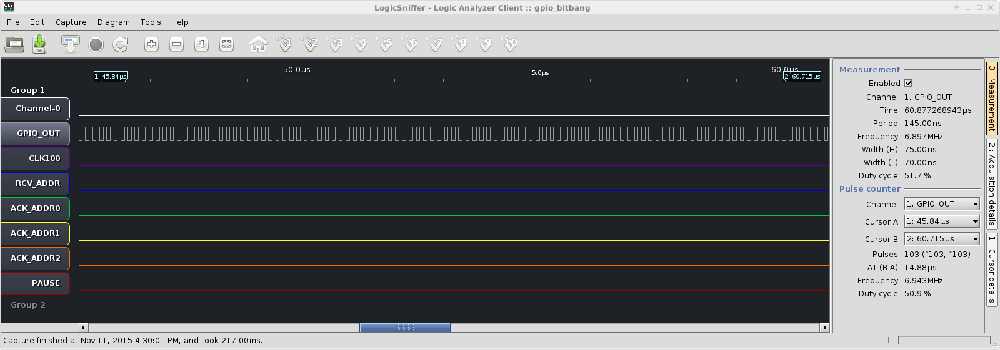
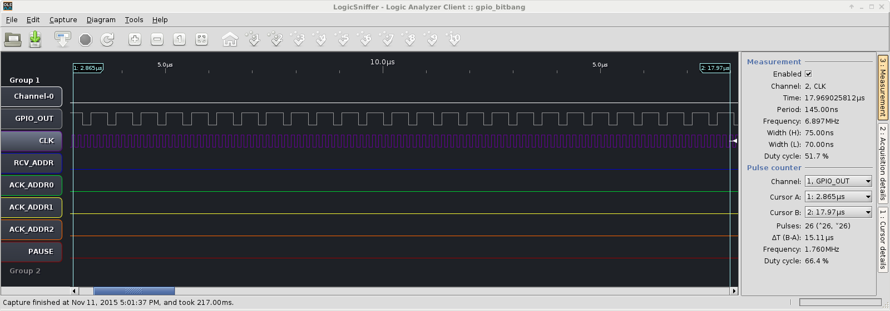
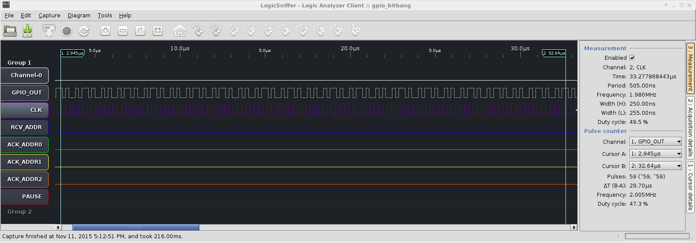
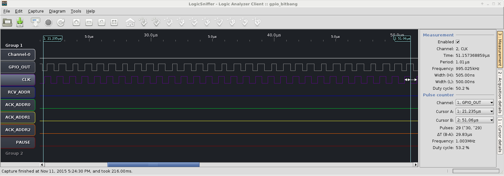
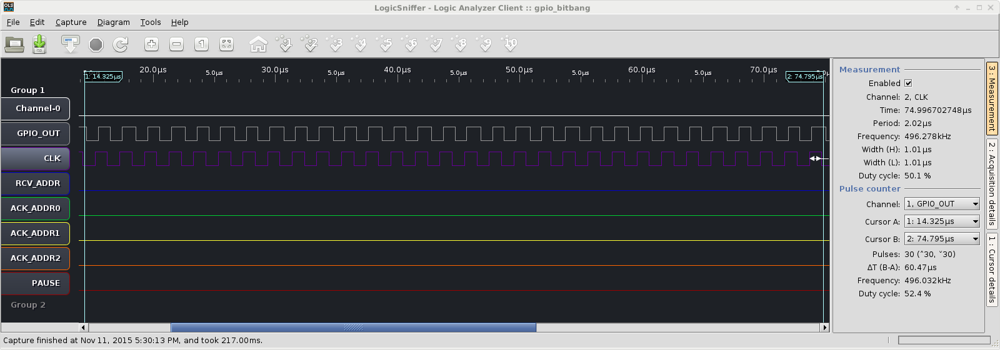

# Documentation #

Sampling by my logic analyser is done @ 200 MHz in all this document.

## Max GPIO toggling frequency ##

This test tries to toggle as fast as possible some GPIO pin on the Pipistrello FPGA board by the mean of software bit banging on the LM32 CPU
running @ 83.3 MHz.

The gateware code used is there: 
* https://github.com/fallen/i2cslave/blob/bitbangtesting/i2cslave/targets/pipistrello_i2c.py#L48
* https://github.com/fallen/i2cslave/blob/bitbangtesting/i2cslave/targets/pipistrello_i2c.py#L201

The bit banging software code is there:
* https://github.com/fallen/i2cslave/blob/bitbangtesting/i2cslave/software/main.c#L22 from line 22 to 26

It looks like:
```C
while(1)
{
    gpio_inout__w_write(value | GPIO_INOUT_OE);
    value = 1 - value;
}
```

Here is the result as showed by my logic analyzer:


The bit banging code can generate a ~ 7 MHz clock while doing nothing else.

## Clock replicating ##

This tests shows the capacity of bit banging software to read a pin status and then write to another one in a tight loop.

The gateware is generating a 100 kHz clock: 
* https://github.com/fallen/i2cslave/blob/bitbangtesting/i2cslave/targets/pipistrello_i2c.py#L27
* https://github.com/fallen/i2cslave/blob/bitbangtesting/i2cslave/targets/pipistrello_i2c.py#L202

The software will, in a tight loop, sample this signal and write its value to the gpio_out pin:
* https://github.com/fallen/i2cslave/blob/bitbangtesting/i2cslave/software/main.c#L29

```C
while(1)
{
    gpio_inout__w_write(clock__r_read() | GPIO_INOUT_OE);
}
```

Let's see what happens:


The clock is replicated correctly, the frequency is approximately the same.

Something also interesting to have a look at is the latency of such code: the time between sampling the clock and writing to the `gpio_out` pin:


We can see that the latency is ~ 325 ns which is ~ 27 CPU clock cycles.

## Some more clock replicating ##

We saw that we can replicate a 100 kHz clock, and that we can generate a 7 MHz one, what about replicating a 7 MHz one?

I modified [this line](https://github.com/fallen/i2cslave/blob/bitbangtesting/i2cslave/targets/pipistrello_i2c.py#L32) of the gateware to generate a 7 MHz clock so that it reads `ratio = int(83.3e6//7e6//2)`

Here is the screenshot:


As you can see, it fails completely to generate the same frequency.
The generated clock is ~ 1.7 MHz

Let's try with a 2 MHz clock input then:



This time the frequency is correct but the duty cycle and waveform shape is not so good.

Let's try with a 1 MHz clock input:



This time frequency is perfect and waveform is way better (still not perfect though).

Let's try with a 500 kHz clock input:



This time it's all good!

## Turn around time ##

Let's try to measure the time needed when some event (trigger) is detected on a pin (configured as input) to configure it as output and output some other value.

Here I am connecting the pin 12 of my Arduino to the GPIO I'm using for those tests on my Pipistrello FPGA board.

The Arduino runs the following code:

```C
void setup() {
  //start serial connection
  Serial.begin(9600);
}

void loop() {
  pinMode(12, OUTPUT);      // set pin 12 as output
  digitalWrite(12, LOW);    // set pin 12 as low
  Serial.println("waiting");
  delay(10000);             // wait 10 seconds
  Serial.println("pull up!");
  pinMode(12, INPUT_PULLUP);// set the pin 12 as input with internal pull-up
  delay(10000);             // wait 10 seconds
}
```

The LM32 runs the following code:

```C
gpio_inout__w_write(0);             // set the GPIO as input
while(!gpio_inout__r_read());       // wait for GPIO rising edge
gpio_inout__w_write(GPIO_INOUT_OE); // set GPIO as output and low
while(1);                           // wait forever
```

So basically the Arduino starts first and set its pin 12 (and therefore the GPIO input of the LM32) as low.
The LM32 waits for some rising edge.
10 seconds later, the Arduno sets its pin 12 as INPUT - Pull-up which then lets the line go high since nobody is driving it.
The LM32 detects that and stops its busy waiting and then set the GPIO as output and drives it low.

The screenshot should then show the GPIO as low, then high, then low:


We can see that the turn around time is ~ 550 ns which is ~ 46 LM32 CPU clock cycles.
